# Understanding mediasoup

mediasoup is a powerful WebRTC SFU (Selective Forwarding Unit) library. This guide explains how it works in simple terms.

## What is an SFU?

An SFU (Selective Forwarding Unit) is a server that receives media streams from participants and forwards them to others. Unlike peer-to-peer, all media flows through the server.

### Peer-to-Peer (Mesh) - The Problem

> **Problem:** Each person sends to everyone (N×N connections). With 4 people, that's 6 connections. With 10 people, that's 45 connections!

### SFU Architecture - The Solution

> **Solution:** Each person sends once, server forwards to everyone else. Scales much better!

## Core Concepts

### 1. Worker

A Worker is a separate process that handles media. Think of it as a "media engine."

**Key points:**

- One Worker per CPU core (recommended)
- Workers are isolated - if one crashes, others continue
- Workers handle the heavy lifting of media processing

### 2. Router

A Router is like a "virtual room" inside a Worker. It routes media between participants.

**Key points:**

- One Router per conference room (typically)
- Router knows which media goes where
- Participants in the same Router can exchange media

### 3. Transport

A Transport is the network connection between a client and the server. It carries media data.

**Each participant typically has 2 transports:**

- **Send Transport** - for sending their media (camera, mic, screen)
- **Receive Transport** - for receiving others' media

### 4. Producer

A Producer sends media to the server. When you share your camera, you create a Producer.

```mermaid
graph TB
    CAM["📷 Camera<br/>(Device)"] --> MS["MediaStream Track<br/>(video)"]
    MS --> ENC["Browser Encodes<br/>to VP8/H264"]
    ENC --> PROD["Producer<br/>id: 'abc'<br/>kind: video"]
    PROD --> SERVER["Server (Router)"]
```

**Producer types:**

- `audio` - Microphone
- `video` - Camera
- `video` (with `screen` label) - Screen share

### 5. Consumer

A Consumer receives media from the server. When you see someone's video, that's a Consumer.

**Key insight:** One Producer can have many Consumers. Bob's camera creates 1 Producer, but Alice, Charlie, and Dave each get their own Consumer for it.

```mermaid
graph TB
    BOB["Bob's Camera"] --> PROD["Producer<br/>(1 instance)"]
    PROD --> SERVER((Router))
    
    SERVER --> CA["Consumer → Alice"]
    SERVER --> CC["Consumer → Charlie"]
    SERVER --> CD["Consumer → Dave"]
```

## Complete Flow Diagram

Here's how everything connects when Alice joins a room and shares her camera:

## RTP Capabilities

Before producing or consuming, clients and server exchange "RTP Capabilities" - a list of supported codecs and features.

```mermaid
graph LR
    subgraph "Client Capabilities"
        CC["Codecs:<br/>- VP8<br/>- VP9<br/>- H264<br/>- Opus"]
    end
    
    subgraph "Server Capabilities"
        SC["Codecs:<br/>- VP8<br/>- H264<br/>- VP9<br/>- Opus"]
    end
    
    CC -->|"∩ Intersection"| NR
    SC -->|"∩ Intersection"| NR
    
    subgraph "Negotiated Result"
        NR["Common Codecs:<br/>✓ VP8<br/>✓ VP9<br/>✓ H264<br/>✓ Opus"]
    end
```

## Simulcast

Simulcast sends multiple quality layers of the same video. The server can forward different qualities to different receivers.

```mermaid
graph TB
    CAM["📷 Alice's Camera"] --> H["High<br/>1080p / 2.5Mbps"]
    CAM --> M["Medium<br/>480p / 500Kbps"]
    CAM --> L["Low<br/>180p / 100Kbps"]
    
    H --> SERVER((Server<br/>Router))
    M --> SERVER
    L --> SERVER
    
    SERVER -->|"HIGH"| BOB["Bob (WiFi)"]
    SERVER -->|"MEDIUM"| CHARLIE["Charlie (4G)"]
    SERVER -->|"LOW"| DAVE["Dave (3G)"]
```

## Summary

| Concept       | What it is                    | Analogy                       |
| ------------- | ----------------------------- | ----------------------------- |
| **Worker**    | Process handling media        | Kitchen in a restaurant       |
| **Router**    | Virtual room for participants | A private dining room         |
| **Transport** | Network connection            | The waiter serving your table |
| **Producer**  | Sends media to server         | Chef preparing your dish      |
| **Consumer**  | Receives media from server    | You eating the dish           |

## Next Steps

- [QuickRTC Architecture](/docs/concepts/quickrtc-architecture) - How QuickRTC simplifies mediasoup
- [Getting Started](/docs/getting-started) - Build your first app
