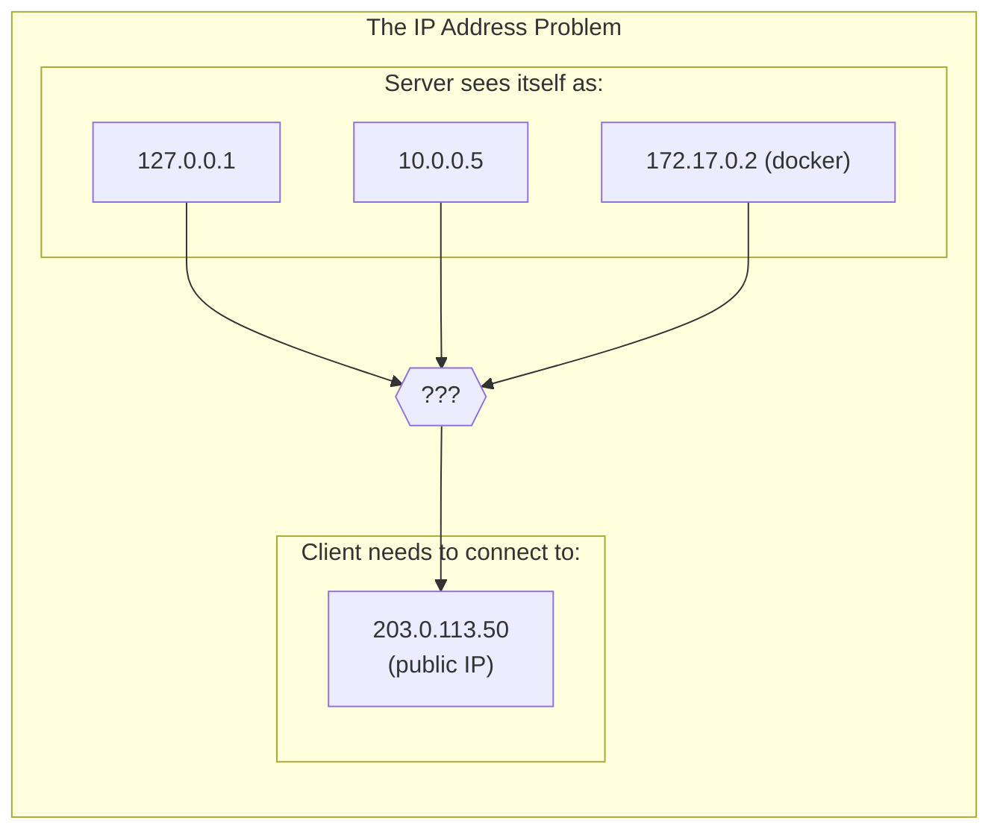
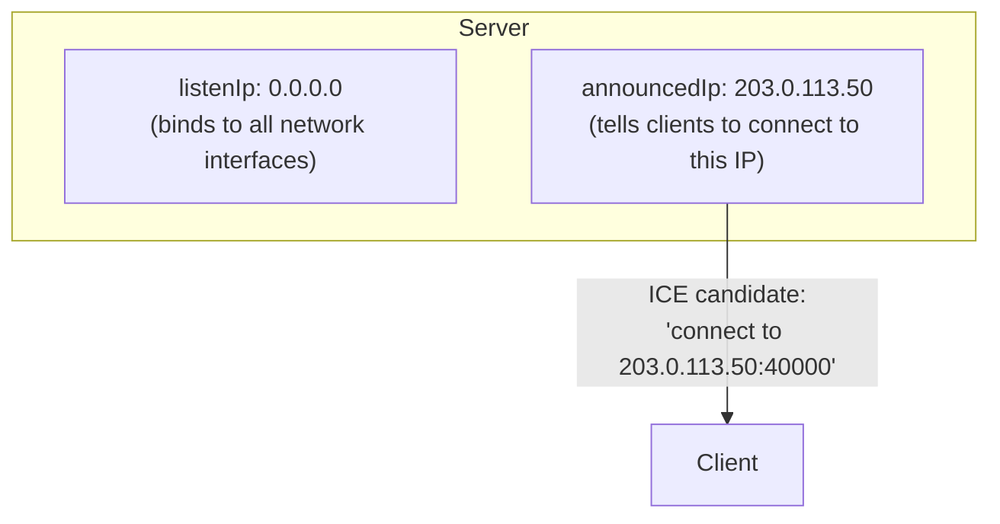
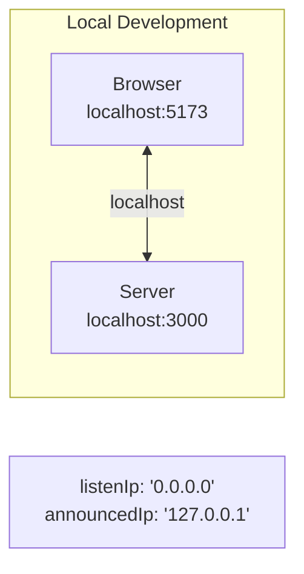
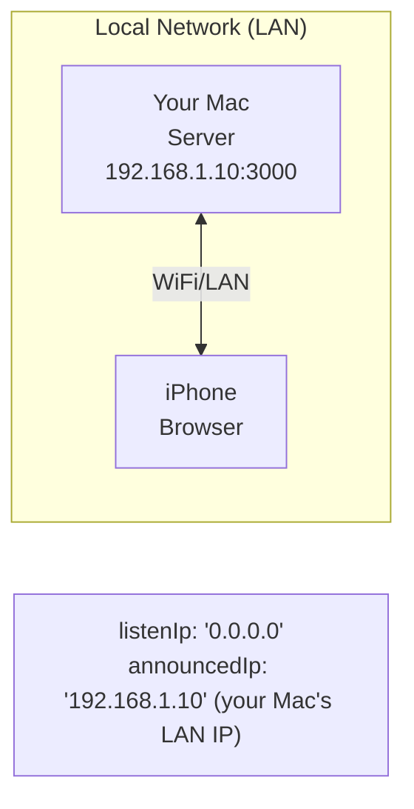
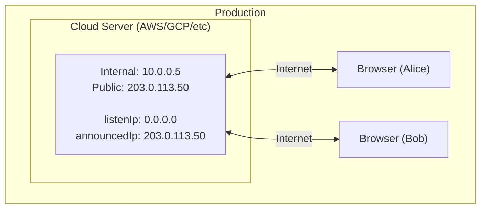
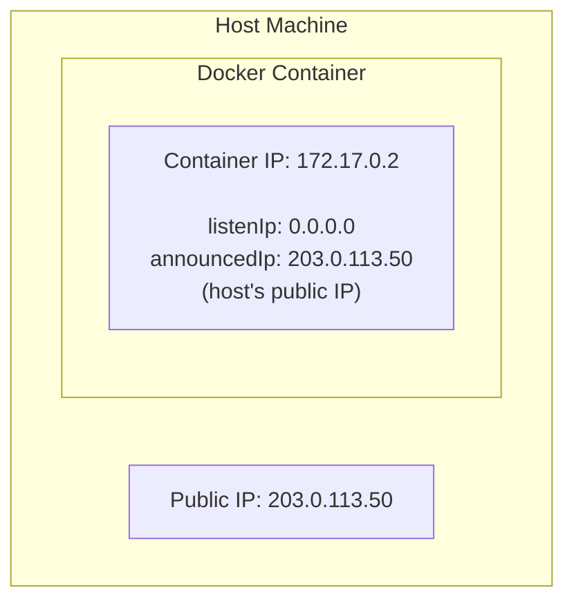

# Network Configuration (IP Addresses)

Understanding `listenIp` and `announcedIp` is critical for WebRTC to work correctly. This guide explains these concepts and how to configure them for different environments.

## The Problem

WebRTC uses ICE (Interactive Connectivity Establishment) to discover the best network path between clients and the server. The server must advertise IP addresses that clients can actually reach.



> **Which IP should the server advertise to clients?**

## Two Key Concepts

### 1. Listen IP (`listenIp`)

The IP address that mediasoup **binds to** on the server. This is the internal address where the server listens for incoming connections.

- Usually `0.0.0.0` to listen on all interfaces
- Or a specific internal IP like `10.0.0.5`

### 2. Announced IP (`announcedIp`)

The IP address that mediasoup **advertises to clients** in ICE candidates. This must be an IP that clients can reach.

- For local dev: `127.0.0.1` or your machine's LAN IP
- For production: Your server's public IP



## Configuration in QuickRTC

```typescript
const server = new QuickRTCServer({
  httpServer: httpsServer,
  socketServer: io,
  quickrtcConfig: {
    webRtcServerOptions: {
      listenInfos: [{
        ip: "0.0.0.0",           // listenIp - bind to all interfaces
        announcedIp: "x.x.x.x",  // announcedIp - what clients see
      }],
    },
  },
});
```

## Environment-Specific Configuration

### Local Development (Same Machine)

When running both client and server on the same machine:



```typescript
// Local development - same machine
const getAnnouncedIp = () => {
  return process.env.ANNOUNCED_IP || "127.0.0.1";
};
```

**Client URL:** `https://localhost:5173`

### Local Network Development (LAN)

When testing with multiple devices on the same network (e.g., testing on phone):



```typescript
// LAN development - multiple devices
const getAnnouncedIp = () => {
  return process.env.ANNOUNCED_IP || "192.168.1.10"; // Your machine's LAN IP
};
```

**Client URL:** `https://192.168.1.10:5173`

**Find your LAN IP:**
```bash
# macOS
ipconfig getifaddr en0

# Linux
hostname -I | awk '{print $1}'

# Windows
ipconfig | findstr IPv4
```

### Production (Public Server)

When deploying to a cloud server with a public IP:



```typescript
// Production - use public IP or auto-detect
const getAnnouncedIp = () => {
  // Always set ANNOUNCED_IP in production
  return process.env.ANNOUNCED_IP;
};
```

**Get your public IP:**
```bash
# From the server
curl -s ifconfig.me

# Or from cloud metadata
# AWS
curl -s http://169.254.169.254/latest/meta-data/public-ipv4

# GCP
curl -s -H "Metadata-Flavor: Google" http://metadata.google.internal/computeMetadata/v1/instance/network-interfaces/0/access-configs/0/external-ip
```

### Docker Deployment

Docker adds another layer of networking complexity:



**Option 1: Host Network Mode (Recommended)**

```yaml
# docker-compose.yml
services:
  quickrtc:
    network_mode: host
    environment:
      - ANNOUNCED_IP=203.0.113.50
```

**Option 2: Port Mapping**

```yaml
services:
  quickrtc:
    ports:
      - "3000:3000"
      - "40000-40100:40000-40100/udp"
    environment:
      - ANNOUNCED_IP=203.0.113.50  # Host's public IP, NOT container IP
```

## Common Configuration Patterns

### Pattern 1: Environment-Based Configuration

```typescript
const getAnnouncedIp = (): string | undefined => {
  // 1. Always prefer explicit environment variable
  if (process.env.ANNOUNCED_IP) {
    return process.env.ANNOUNCED_IP;
  }

  // 2. Development fallbacks
  if (process.env.NODE_ENV === "development") {
    return "127.0.0.1";
  }

  // 3. Production: must be set explicitly
  throw new Error("ANNOUNCED_IP environment variable is required in production");
};
```

### Pattern 2: Auto-Detection with Fallback

```typescript
import os from "os";

const getLocalIp = (): string => {
  const interfaces = os.networkInterfaces();
  for (const name of Object.keys(interfaces)) {
    for (const iface of interfaces[name] || []) {
      // Skip internal and IPv6 addresses
      if (iface.family === "IPv4" && !iface.internal) {
        return iface.address;
      }
    }
  }
  return "127.0.0.1";
};

const getAnnouncedIp = (): string => {
  return process.env.ANNOUNCED_IP || getLocalIp();
};
```

### Pattern 3: Complete Example

```typescript
// server/src/index.ts
import express from "express";
import https from "https";
import fs from "fs";
import { Server as SocketIOServer } from "socket.io";
import { QuickRTCServer } from "quickrtc-server";

const PORT = parseInt(process.env.PORT || "3000");
const RTC_MIN_PORT = parseInt(process.env.RTC_MIN_PORT || "40000");
const RTC_MAX_PORT = parseInt(process.env.RTC_MAX_PORT || "40100");

// Network configuration
const getListenIp = (): string => {
  // Always bind to all interfaces
  return "0.0.0.0";
};

const getAnnouncedIp = (): string | undefined => {
  if (process.env.ANNOUNCED_IP) {
    return process.env.ANNOUNCED_IP;
  }
  
  // Local development: use localhost
  if (process.env.NODE_ENV !== "production") {
    return "127.0.0.1";
  }
  
  // Production: require explicit configuration
  console.warn("WARNING: ANNOUNCED_IP not set. WebRTC may not work correctly.");
  return undefined;
};

const app = express();

const server = https.createServer({
  key: fs.readFileSync("certs/key.pem"),
  cert: fs.readFileSync("certs/cert.pem"),
}, app);

const io = new SocketIOServer(server, {
  cors: { origin: "*" },
});

const listenIp = getListenIp();
const announcedIp = getAnnouncedIp();

console.log(`Listen IP: ${listenIp}`);
console.log(`Announced IP: ${announcedIp}`);

const quickrtc = new QuickRTCServer({
  httpServer: server,
  socketServer: io,
  quickrtcConfig: {
    workerSettings: {
      rtcMinPort: RTC_MIN_PORT,
      rtcMaxPort: RTC_MAX_PORT,
    },
    webRtcServerOptions: {
      listenInfos: [{
        ip: listenIp,
        announcedIp: announcedIp,
      }],
    },
  },
});

quickrtc.start().then(() => {
  server.listen(PORT, () => {
    console.log(`Server running on https://localhost:${PORT}`);
  });
});
```

## Troubleshooting

### Symptom: Video/Audio Not Working

**Cause:** `announcedIp` doesn't match how clients connect.

```
Client connects to:    https://192.168.1.10:3000
Server announces:      127.0.0.1
Result:                ICE fails, no media flows
```

**Fix:** Set `announcedIp` to match the IP clients use to connect.

### Symptom: Works Locally, Fails in Production

**Cause:** `announcedIp` is set to localhost or private IP.

**Fix:** Set `ANNOUNCED_IP` to your server's public IP.

```bash
export ANNOUNCED_IP=$(curl -s ifconfig.me)
```

### Symptom: Works on Desktop, Fails on Mobile

**Cause:** Using `localhost` which only works on the same machine.

**Fix:** Use your machine's LAN IP and connect via that IP on mobile.

```bash
# Get your LAN IP
ipconfig getifaddr en0  # macOS

# Set it
export ANNOUNCED_IP=192.168.1.10
```

### Symptom: SSL Certificate Error

When using a LAN IP, you need SSL certificates that cover that IP:

```bash
# Generate cert with IP in SAN (Subject Alternative Name)
openssl req -x509 -newkey rsa:4096 \
  -keyout key.pem -out cert.pem \
  -sha256 -days 365 -nodes \
  -subj '/CN=localhost' \
  -addext 'subjectAltName=DNS:localhost,IP:127.0.0.1,IP:192.168.1.10'
```

Then trust the certificate:
- **macOS:** Add to Keychain and trust
- **iOS Safari:** Visit the server URL and accept the certificate
- **Chrome:** Type `thisisunsafe` on the warning page

## Quick Reference

| Environment | Client URL | announcedIp |
|-------------|------------|-------------|
| Local (same machine) | `https://localhost:5173` | `127.0.0.1` |
| LAN (phone testing) | `https://192.168.x.x:5173` | `192.168.x.x` |
| Production | `https://yourdomain.com` | Server's public IP |
| Docker (host mode) | `https://yourdomain.com` | Host's public IP |
| Docker (bridge mode) | `https://yourdomain.com` | Host's public IP (not container IP) |

## Environment Variables

| Variable | Description | Example |
|----------|-------------|---------|
| `ANNOUNCED_IP` | IP to advertise to clients | `203.0.113.50` |
| `RTC_MIN_PORT` | Minimum UDP port | `40000` |
| `RTC_MAX_PORT` | Maximum UDP port | `40100` |

## Next Steps

- [Deployment Overview](/docs/deployment/overview) - Deploy to production
- [Docker Deployment](/docs/deployment/docker) - Container deployment
- [Understanding mediasoup](/docs/concepts/mediasoup) - Core concepts
