# QuickRTC Architecture

QuickRTC is a high-level abstraction over mediasoup that simplifies WebRTC conferencing. This guide explains how QuickRTC works and how it differs from raw mediasoup.

## The Problem QuickRTC Solves

Using mediasoup directly requires managing many low-level details:

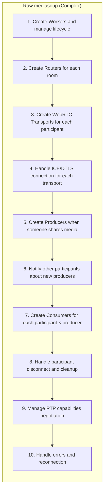

> **~500-1000 lines of boilerplate code required!**

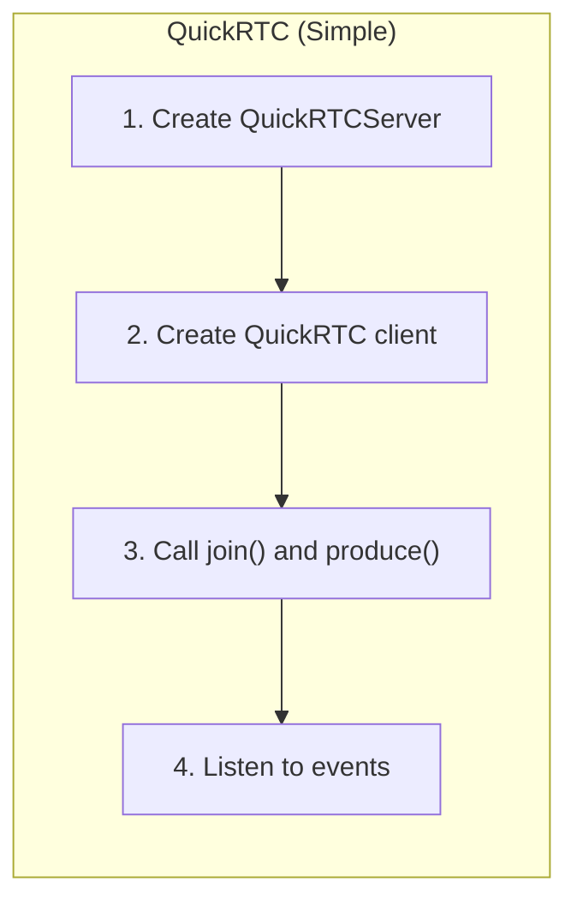

> **~50 lines of code. That's it!**

## Architecture Overview

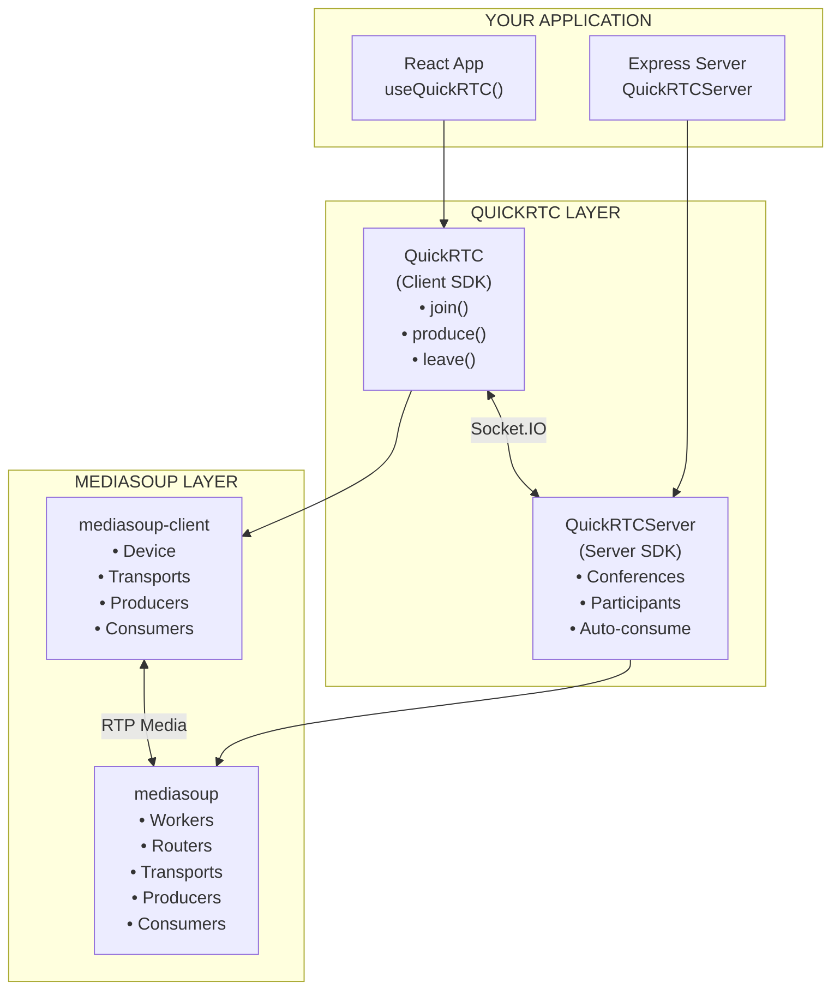

## Package Structure

QuickRTC consists of three packages:

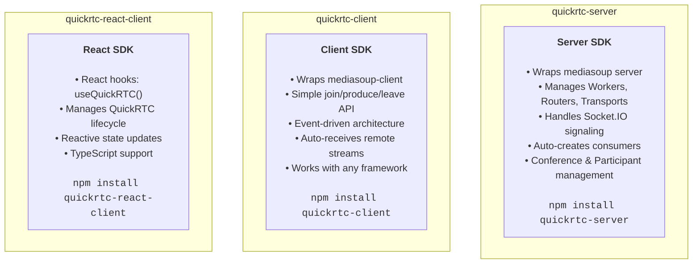

## Data Flow

### Join Conference Flow

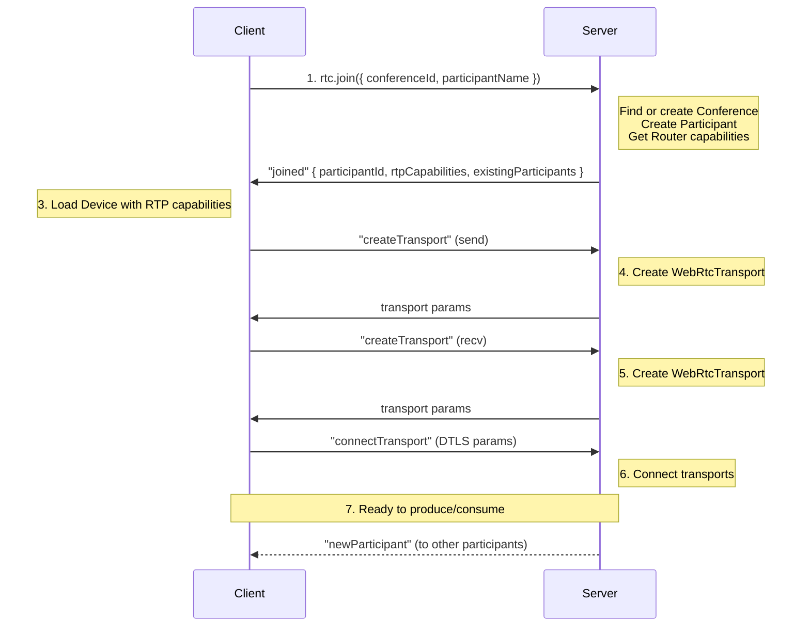

### Produce Media Flow

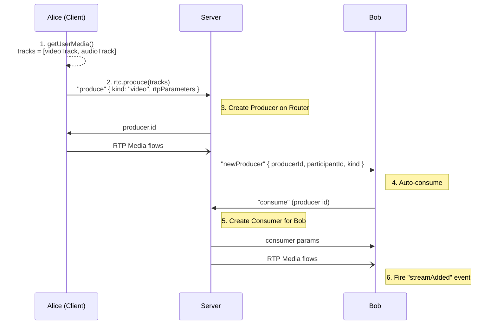

### Auto-Consume Feature

QuickRTC automatically creates consumers when new producers appear. You just listen to events:

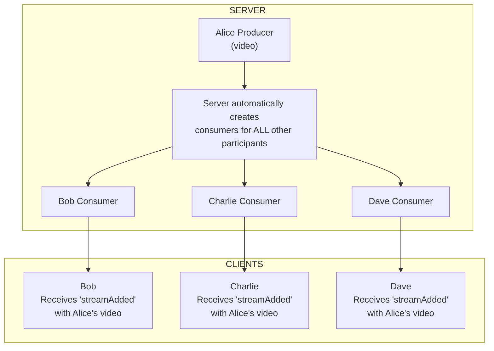

> **No manual subscription needed!**

## Event System

QuickRTC uses an event-driven architecture:

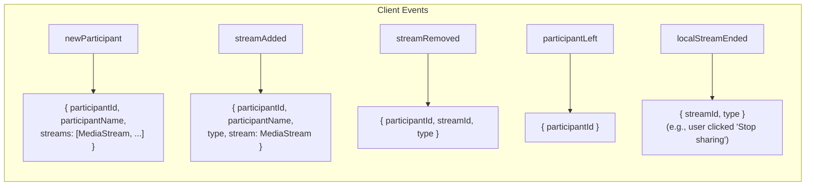

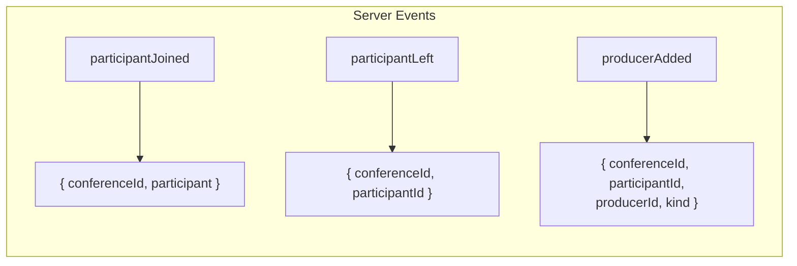

## LocalStream Controls

When you produce media, you get back LocalStream objects with built-in controls:

```typescript
const streams = await rtc.produce(tracks);

streams.forEach(stream => {
  console.log(stream.id);      // Unique stream ID
  console.log(stream.type);    // "audio" | "video" | "screenshare"
  console.log(stream.stream);  // MediaStream object
  console.log(stream.track);   // MediaStreamTrack

  // Controls
  stream.pause();   // Pause sending (receivers see frozen frame)
  stream.resume();  // Resume sending
  stream.stop();    // Stop completely (removes producer)
});
```

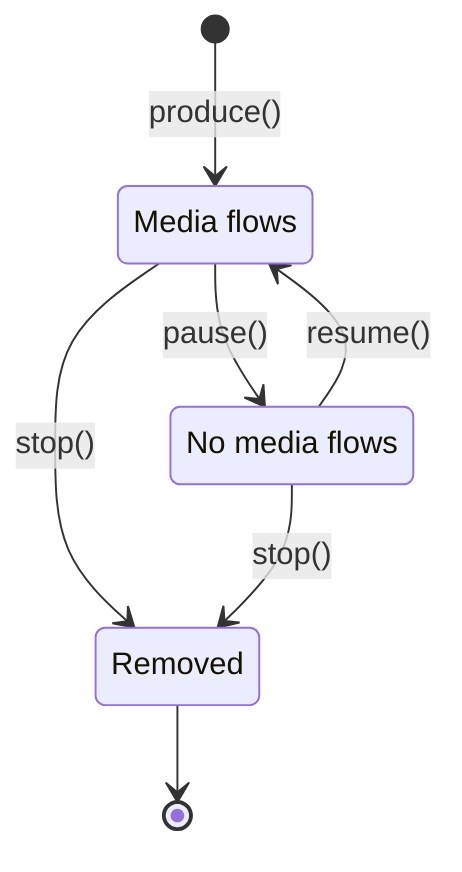

## Complete Integration Example

```mermaid
graph TB
    subgraph "SERVER SETUP"
        S1["const io = new Server(httpServer);"]
        S2["const quickrtc = new QuickRTCServer({<br/>  httpServer,<br/>  socketServer: io,<br/>});"]
        S3["await quickrtc.start();"]
        S4["// That's it! Server handles everything"]
        
        S1 --> S2 --> S3 --> S4
    end
    
    subgraph "CLIENT SETUP"
        C1["// 1. Connect<br/>const socket = io('https://server.com');<br/>const rtc = new QuickRTC({ socket });"]
        C2["// 2. Listen for remote participants<br/>rtc.on('newParticipant', ...);<br/>rtc.on('streamAdded', ...);"]
        C3["// 3. Join room<br/>await rtc.join({<br/>  conferenceId: 'room-123',<br/>  participantName: 'Alice'<br/>});"]
        C4["// 4. Share camera<br/>const media = await getUserMedia(...);<br/>await rtc.produce(media.getTracks());"]
        C5["// 5. Leave when done<br/>await rtc.leave();"]
        
        C1 --> C2 --> C3 --> C4 --> C5
    end
```

## QuickRTC vs Raw mediasoup

| Feature              | Raw mediasoup    | QuickRTC              |
| -------------------- | ---------------- | --------------------- |
| Lines of code        | 500-1000         | 50-100                |
| Transport management | Manual           | Automatic             |
| Consumer creation    | Manual           | Automatic             |
| Event handling       | Low-level        | High-level            |
| Learning curve       | Steep            | Gentle                |
| Flexibility          | Maximum          | Opinionated           |
| Use case             | Custom solutions | Standard conferencing |

## When to Use QuickRTC

**Use QuickRTC when:**

- Building standard video conferencing
- You want rapid development
- You don't need custom media routing
- You're building with React

**Use raw mediasoup when:**

- You need custom routing logic
- Building broadcast/streaming apps
- You need fine-grained control
- Building non-standard WebRTC apps

## Next Steps

- [Getting Started](/docs/getting-started) - Build your first app
- [Understanding mediasoup](/docs/concepts/mediasoup) - Learn the underlying technology
- [React Integration](/docs/react/overview) - Use with React
